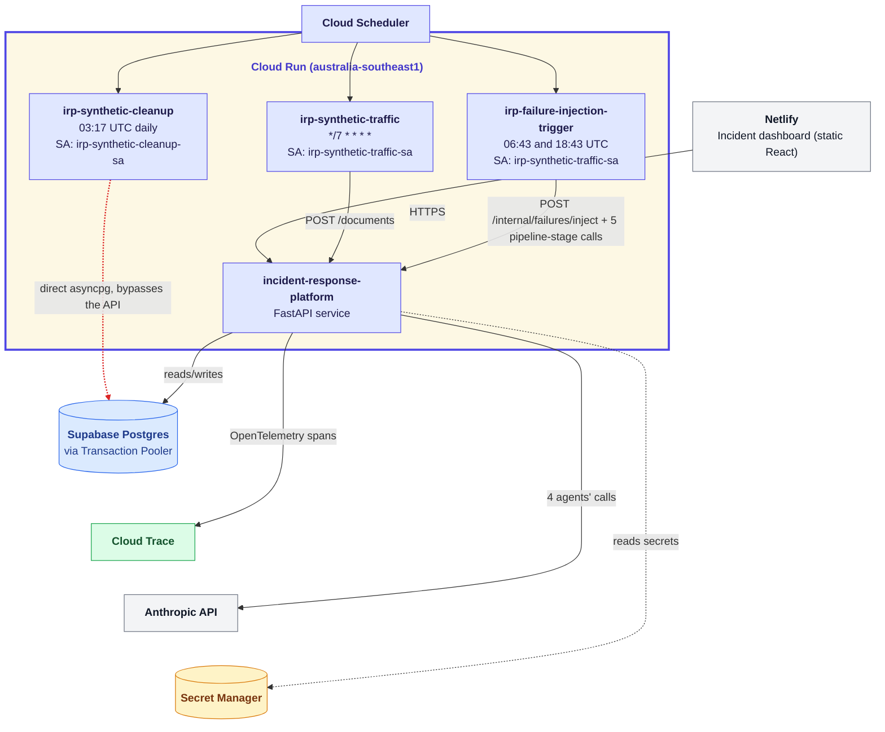

# Live infrastructure

The FastAPI backend runs continuously on Cloud Run, backed by Supabase
Postgres and Google Secret Manager. Three background Cloud Run Jobs —
synthetic traffic, a daily cleanup, and a twice-daily failure-injection
trigger — are fired by Cloud Scheduler and generate real, ongoing
activity against the live service. A Netlify-hosted dashboard reads and
approves/rejects incidents over CORS-permitted HTTPS, and the four AI
agents call Anthropic's API directly from the backend, with every call
traced to Google Cloud Trace via OpenTelemetry.

**Reading the diagram**: three tiers, top to bottom. Cloud Scheduler
and Netlify are the only two things that originate activity from
outside the system. The Cloud Run Service and all three background
Jobs are grouped into one cluster — together, they're "the deployed
application." Secret Manager, Supabase, Anthropic, and Cloud Trace sit
below as what that cluster reads from or calls out to.

Secret Manager is drawn with a single edge to the Service rather than
one arrow per consumer, to avoid four near-identical arrows: in
practice, the traffic and trigger Jobs each read `api-key`, the
cleanup Job reads `database-url` directly, and the Service reads all
three (`api-key`, `database-url`, `anthropic-api-key`).

The one red dashed arrow is the diagram's single deliberate exception:
`irp-synthetic-cleanup` connects to Supabase directly over `asyncpg`,
bypassing the API entirely — everything else flows through the one
FastAPI service. It's styled like the pipeline diagram's escalation
paths for the same reason: not unimportant, but worth noticing
precisely because it's the one path that breaks the general pattern.

Netlify's call into the Service is a CORS-permitted HTTPS request —
the only origin the backend's `CORS_ALLOWED_ORIGINS` setting allows
besides local dev.

`irp-synthetic-traffic-sa` is deliberately **reused** by both
`irp-synthetic-traffic` and `irp-failure-injection-trigger` — both only
ever make HTTP calls to the public API with an API key, an identical
capability shape. `irp-synthetic-cleanup` gets its own service account
(`irp-synthetic-cleanup-sa`) because it needs a materially more
sensitive capability instead: that direct database connection (see
`STATUS.md`, 2026-09-07). The dashboard never talks to the database,
Secret Manager, or Anthropic directly — every path runs through the
one FastAPI service.
