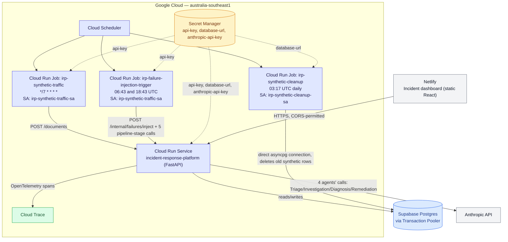

# Live infrastructure

The FastAPI backend runs continuously on Cloud Run, backed by Supabase
Postgres and Google Secret Manager. Three background Cloud Run Jobs —
synthetic traffic, a daily cleanup, and a twice-daily failure-injection
trigger — are fired by Cloud Scheduler and generate real, ongoing
activity against the live service. A Netlify-hosted dashboard reads and
approves/rejects incidents over CORS-permitted HTTPS, and the four AI
agents call Anthropic's API directly from the backend, with every call
traced to Google Cloud Trace via OpenTelemetry.

**Reading the diagram**: dashed arrows are Secret Manager grants, not
traffic. `irp-synthetic-traffic-sa` is deliberately **reused** by both
`irp-synthetic-traffic` and `irp-failure-injection-trigger` — both only
ever make HTTP calls to the public API with an API key, an identical
capability shape. `irp-synthetic-cleanup` gets its own service account
(`irp-synthetic-cleanup-sa`) because it needs a materially more
sensitive capability instead: a direct database connection, bypassing
the API entirely (see `STATUS.md`, 2026-09-07). The dashboard never
talks to the database, Secret Manager, or Anthropic directly — every
path runs through the one FastAPI service.
