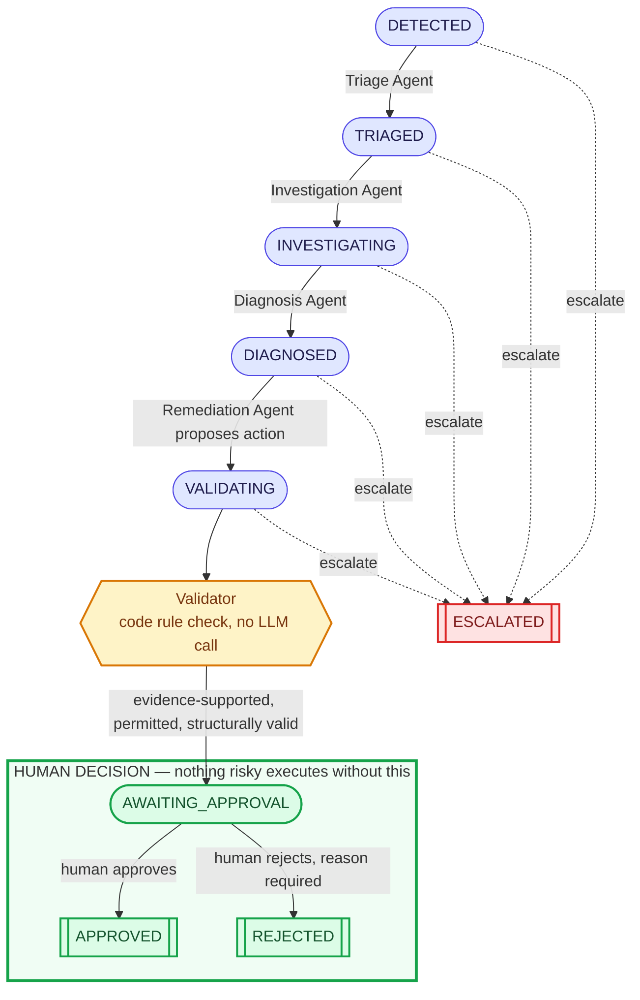

# Incident lifecycle

An incident moves through a fixed state machine, not free-form agent chat:
each of the four AI agents owns exactly one transition, a non-AI Validator
checks the proposed action before anything reaches a human, and a human
always makes the final approve/reject call — nothing risky ever executes
without that explicit decision. Any AI stage can escalate straight to a
human instead of guessing; once a human is asked, the outcome is always a
decision, never an escalation.

**Reading the diagram**: indigo boxes are single-call, structured-output
LLM agents (`app/agents/`, each Pydantic-validated, never a raw string
consumed downstream). The amber hexagon is deliberately not styled like
an agent — it's a fixed set of code rules (`app/policies/validation_policy.py`),
not a model call. The green-bordered box is the one part of this system a
human, not an AI, controls — every dashed red arrow is a legitimate,
tested outcome (timeout, invalid output, low confidence), not a failure
of the system.
